# HRMS CheckIn-Out — Full System Implementation Plan

### For Team Explanation & Backend Development

> Based on: Live browser exploration + full frontend source analysis (March 2026)

---

## Part 1 — What Are We Building?

This system is an **HR Management System (HRMS)** focused on:

1. Employee daily attendance (Check-In / Check-Out)
2. Task reporting per project
3. Leave and WFH request management
4. Admin oversight of all employees

**Tech Stack Decision:**

| Layer               | Technology                              |
| ------------------- | --------------------------------------- |
| Frontend (existing) | React + TypeScript + Vite + TailwindCSS |
| Backend (to build)  | Python + FastAPI                        |
| Database            | PostgreSQL 16                           |
| ORM                 | SQLAlchemy 2.x (async)                  |
| Migrations          | Alembic                                 |
| Auth                | JWT (RS256)                             |
| Cache / Rate Limit  | Redis                                   |
| Job Scheduler       | APScheduler                             |
| Containerization    | Docker + Docker Compose                 |

---

## Part 2 — System Architecture Overview

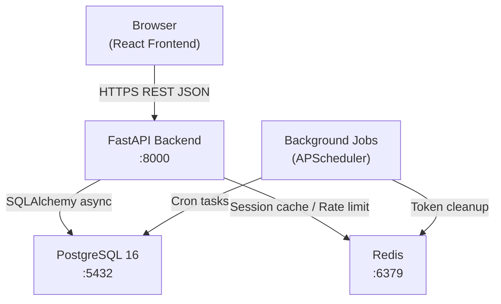

---

## Part 3 — Who Are the Users? (All Role Scenarios)

### Scenario A — Admin is a Dedicated HR Person (Recommended)

The admin account belongs to an HR manager who **only manages** employees. They do NOT check in/out or request leaves themselves.

```
employees table:
┌─────────────────────────────────────────────┐
│ email               │ role     │ tracks_work │
├─────────────────────────────────────────────│
│ nimisha@company.com │ employee │ YES         │
│ john@company.com    │ employee │ YES         │
│ jane@company.com    │ employee │ YES         │
│ admin@company.com   │ admin    │ NO          │
└─────────────────────────────────────────────┘
```

### Scenario B — Admin is Also a Working Employee

The admin is a team lead or senior person who **also works AND manages**. They check in/out like everyone else but also have the Approve/Reject permission.

```
employees table:
┌─────────────────────────────────────────────┐
│ email               │ role     │ tracks_work │
├─────────────────────────────────────────────│
│ nimisha@company.com │ employee │ YES         │
│ john@company.com    │ employee │ YES         │
│ ravi@company.com    │ admin    │ YES         │← works AND approves
└─────────────────────────────────────────────┘
```

> **Decision for this project:** We will implement **one `employees` table for everyone**. The `role` column (`employee` / `admin`) controls what they can see and do. If the admin is Scenario A, we simply don't create attendance sessions for them. If Scenario B, they use the system exactly like an employee but also have admin tabs. **No separate admin table needed.**

---

## Part 4 — Complete User Flow Diagrams

### 4.1 Login Flow

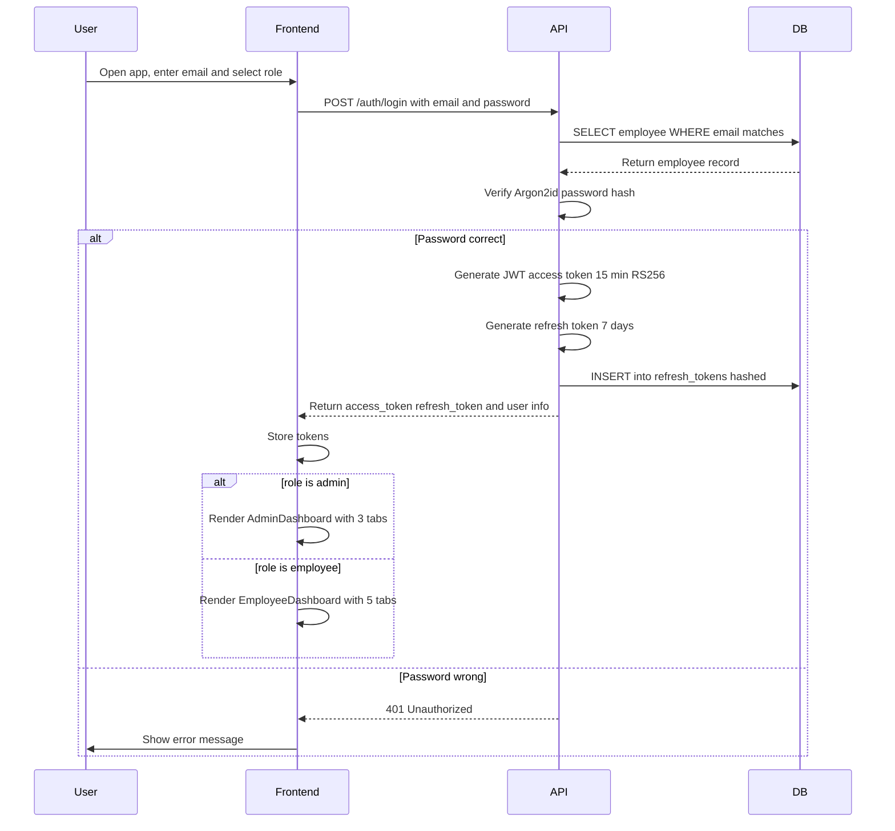

### 4.2 Token Refresh Flow

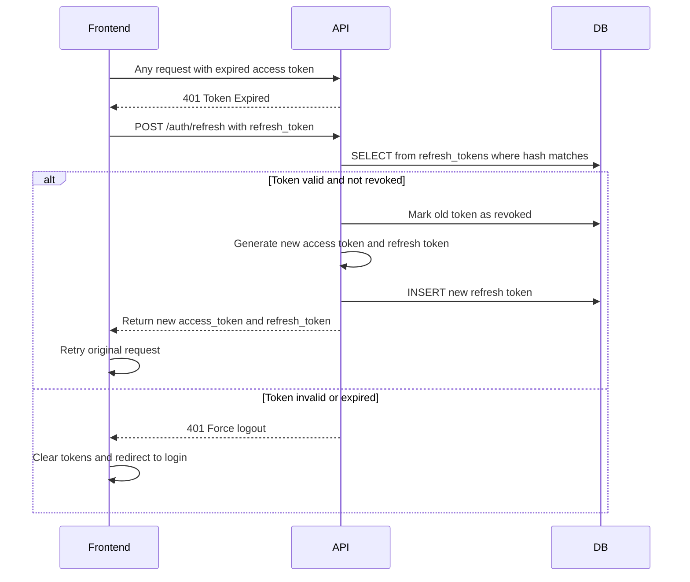

### 4.3 Employee Check-In Flow

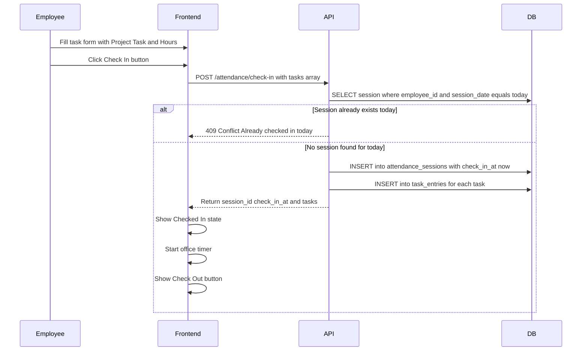

### 4.4 Employee Check-Out Flow

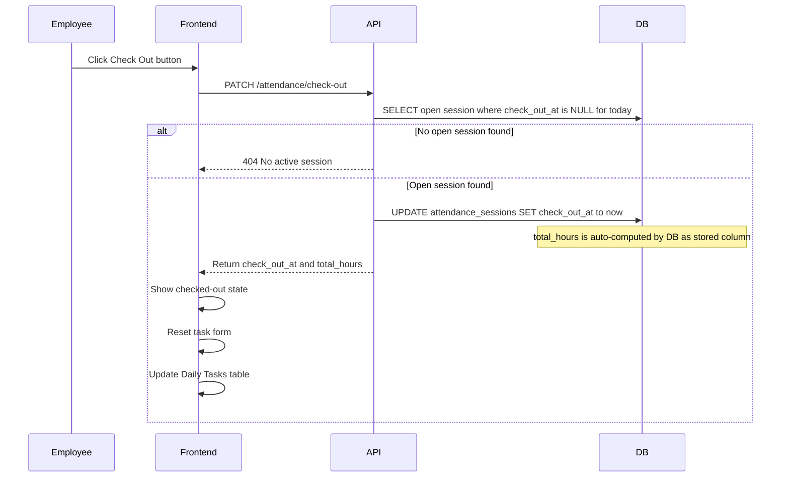

### 4.5 Leave Request Flow (Employee → Admin)

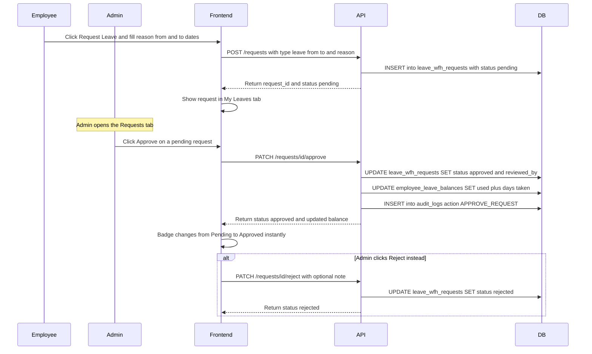

### 4.6 Missing Time Request Flow

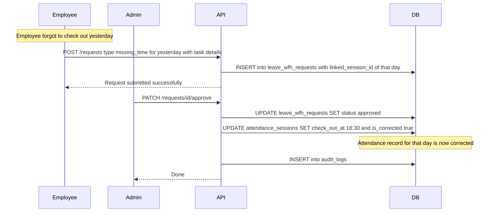

### 4.7 Comp-Off Request Flow

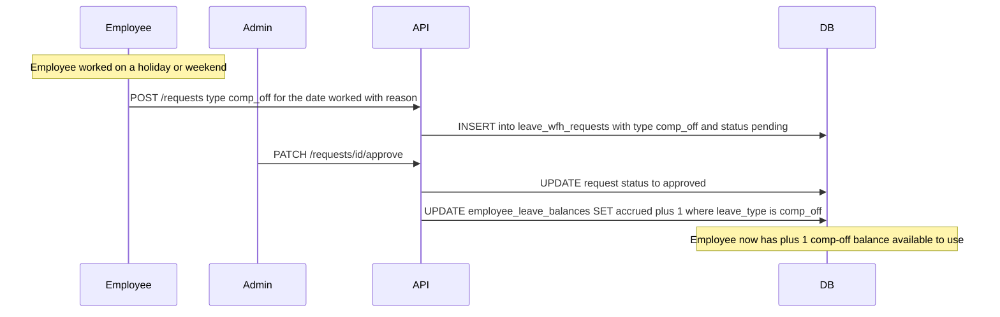

### 4.8 Admin CSV Export Flow

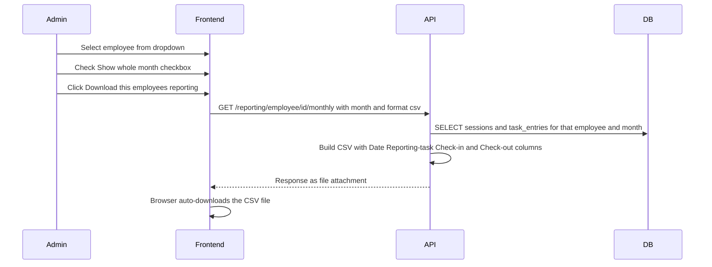

---

## Part 5 — Database Schema (Complete)

### ERD Overview

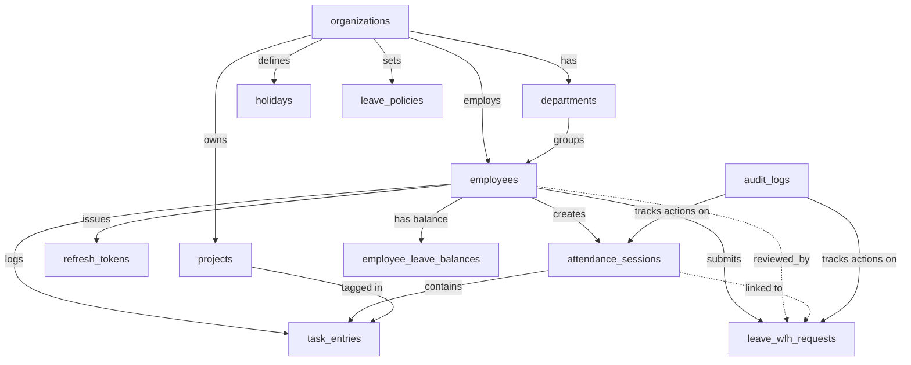

### Table 1 — `organizations`

Single company record (multi-tenant ready if needed later).

```sql
CREATE TABLE organizations (
    id         UUID        PRIMARY KEY DEFAULT gen_random_uuid(),
    name       VARCHAR(255) NOT NULL,
    slug       VARCHAR(100) NOT NULL UNIQUE,
    created_at TIMESTAMPTZ  NOT NULL DEFAULT now(),
    updated_at TIMESTAMPTZ  NOT NULL DEFAULT now()
);
```

### Table 2 — `departments`

Groups employees (e.g. Engineering, Design, HR).

```sql
CREATE TABLE departments (
    id              UUID        PRIMARY KEY DEFAULT gen_random_uuid(),
    organization_id UUID        NOT NULL REFERENCES organizations(id) ON DELETE CASCADE,
    name            VARCHAR(255) NOT NULL,
    created_at      TIMESTAMPTZ  NOT NULL DEFAULT now(),
    UNIQUE(organization_id, name)
);
```

### Table 3 — `employees` *(Single table for ALL users including admin)*

```sql
CREATE TABLE employees (
    id              UUID         PRIMARY KEY DEFAULT gen_random_uuid(),
    organization_id UUID         NOT NULL REFERENCES organizations(id) ON DELETE CASCADE,
    department_id   UUID         REFERENCES departments(id) ON DELETE SET NULL,
    email           VARCHAR(320) NOT NULL UNIQUE,
    password_hash   TEXT         NOT NULL,        -- Argon2id
    full_name       VARCHAR(255) NOT NULL,
    designation     VARCHAR(255) NOT NULL,
    photo_url       TEXT,
    role            VARCHAR(20)  NOT NULL DEFAULT 'employee'
                        CHECK (role IN ('employee', 'admin', 'super_admin')),
    is_active       BOOLEAN      NOT NULL DEFAULT TRUE,   -- soft delete
    joined_on       DATE,
    last_login_at   TIMESTAMPTZ,
    created_at      TIMESTAMPTZ  NOT NULL DEFAULT now(),
    updated_at      TIMESTAMPTZ  NOT NULL DEFAULT now()
);
CREATE INDEX idx_employees_email ON employees(email);
CREATE INDEX idx_employees_org   ON employees(organization_id);
```

**All scenarios covered by this one table:**

- `role='employee'` → normal staff
- `role='admin'` → HR manager (Scenario A: no attendance) OR team lead (Scenario B: has attendance)
- `is_active=FALSE` → ex-employee, data preserved, login blocked
- `photo_url` → feeds the avatar in employee dashboard header

### Table 4 — `refresh_tokens`

Stores hashed refresh tokens for secure session management.

```sql
CREATE TABLE refresh_tokens (
    id          UUID        PRIMARY KEY DEFAULT gen_random_uuid(),
    employee_id UUID        NOT NULL REFERENCES employees(id) ON DELETE CASCADE,
    token_hash  TEXT        NOT NULL UNIQUE,   -- SHA-256 of actual token
    issued_at   TIMESTAMPTZ NOT NULL DEFAULT now(),
    expires_at  TIMESTAMPTZ NOT NULL,
    revoked_at  TIMESTAMPTZ,                   -- NULL = still valid
    ip_address  INET,
    user_agent  TEXT
);
CREATE INDEX idx_rt_employee ON refresh_tokens(employee_id);
CREATE INDEX idx_rt_hash     ON refresh_tokens(token_hash);
```

### Table 5 — `projects`

Replaces the hardcoded `PROJECTS` const in frontend `types.ts`. Admin can add/archive.

```sql
CREATE TABLE projects (
    id              UUID         PRIMARY KEY DEFAULT gen_random_uuid(),
    organization_id UUID         NOT NULL REFERENCES organizations(id) ON DELETE CASCADE,
    name            VARCHAR(255) NOT NULL,
    is_active       BOOLEAN      NOT NULL DEFAULT TRUE,
    created_at      TIMESTAMPTZ  NOT NULL DEFAULT now(),
    UNIQUE(organization_id, name)
);
-- Seed data:
-- UnbounX mobile, UnbounX mobile backend, UnboundX admin,
-- Ubverse frontend, ubverse backend, AI-backend
```

### Table 6 — `attendance_sessions` *(Core Table)*

One record per employee per working day. `check_out_at IS NULL` = currently checke

92d in.

```sql
CREATE TABLE attendance_sessions (
    id              UUID        PRIMARY KEY DEFAULT gen_random_uuid(),
    employee_id     UUID        NOT NULL REFERENCES employees(id) ON DELETE CASCADE,
    organization_id UUID        NOT NULL REFERENCES organizations(id) ON DELETE CASCADE,
    session_date    DATE        NOT NULL,
    check_in_at     TIMESTAMPTZ NOT NULL,
    check_out_at    TIMESTAMPTZ,               -- NULL = currently checked in
    total_hours     NUMERIC(5,2) GENERATED ALWAYS AS (
                        CASE WHEN check_out_at IS NOT NULL
                        THEN EXTRACT(EPOCH FROM (check_out_at - check_in_at)) / 3600.0
                        ELSE NULL END
                    ) STORED,
    work_mode       VARCHAR(20) NOT NULL DEFAULT 'office'
                        CHECK (work_mode IN ('office','wfh','client_site')),
    is_corrected    BOOLEAN     NOT NULL DEFAULT FALSE,
    correction_note TEXT,
    created_at      TIMESTAMPTZ NOT NULL DEFAULT now(),
    updated_at      TIMESTAMPTZ NOT NULL DEFAULT now(),
    CONSTRAINT uq_one_session_per_day UNIQUE (employee_id, session_date),
    CONSTRAINT chk_checkout_after    CHECK (check_out_at IS NULL OR check_out_at > check_in_at)
);
CREATE INDEX idx_sess_emp_date ON attendance_sessions(employee_id, session_date DESC);
CREATE INDEX idx_sess_org_date ON attendance_sessions(organization_id, session_date DESC);
```

**State Machine for a session:**

```
[Employee arrives]
      │
      ▼
 check_in_at = NOW()
 check_out_at = NULL          ← isCheckedIn = TRUE on frontend
      │
      │  (Employee works, saves tasks)
      │
      ▼
 check_out_at = NOW()         ← isCheckedIn = FALSE on frontend
 total_hours = auto-computed
```

### Table 7 — `task_entries`

Many tasks per session. Each task tagged to a project.

```sql
CREATE TABLE task_entries (
    id           UUID        PRIMARY KEY DEFAULT gen_random_uuid(),
    session_id   UUID        NOT NULL REFERENCES attendance_sessions(id) ON DELETE CASCADE,
    project_id   UUID        NOT NULL REFERENCES projects(id) ON DELETE RESTRICT,
    employee_id  UUID        NOT NULL REFERENCES employees(id) ON DELETE CASCADE,
    description  TEXT        NOT NULL,
    hours_logged NUMERIC(5,2) NOT NULL CHECK (hours_logged > 0 AND hours_logged <= 24),
    sort_order   SMALLINT    NOT NULL DEFAULT 0,
    created_at   TIMESTAMPTZ NOT NULL DEFAULT now(),
    updated_at   TIMESTAMPTZ NOT NULL DEFAULT now()
);
CREATE INDEX idx_tasks_session  ON task_entries(session_id);
CREATE INDEX idx_tasks_employee ON task_entries(employee_id);
CREATE INDEX idx_tasks_project  ON task_entries(project_id);
```

### Table 8 — `leave_policies`

Org-level rules. Replaces `LEAVES_PER_MONTH = 1` hardcoded constant.

```sql
CREATE TABLE leave_policies (
    id              UUID        PRIMARY KEY DEFAULT gen_random_uuid(),
    organization_id UUID        NOT NULL REFERENCES organizations(id) ON DELETE CASCADE,
    leave_type      VARCHAR(30) NOT NULL
                        CHECK (leave_type IN ('casual','sick','earned','comp_off')),
    days_per_month  NUMERIC(5,2) NOT NULL DEFAULT 1,
    max_carry_fwd   NUMERIC(5,2) NOT NULL DEFAULT 1,
    is_active       BOOLEAN     NOT NULL DEFAULT TRUE,
    UNIQUE(organization_id, leave_type)
);
```

### Table 9 — `employee_leave_balances` *(The Leave Ledger)*

One row per employee per leave type per month. Tracks opening, accrued, used, adjusted.

```sql
CREATE TABLE employee_leave_balances (
    id              UUID        PRIMARY KEY DEFAULT gen_random_uuid(),
    employee_id     UUID        NOT NULL REFERENCES employees(id) ON DELETE CASCADE,
    leave_type      VARCHAR(30) NOT NULL
                        CHECK (leave_type IN ('casual','sick','earned','comp_off')),
    year            SMALLINT    NOT NULL,
    month           SMALLINT    NOT NULL CHECK (month BETWEEN 1 AND 12),
    opening_balance NUMERIC(5,2) NOT NULL DEFAULT 0,
    accrued         NUMERIC(5,2) NOT NULL DEFAULT 0,
    used            NUMERIC(5,2) NOT NULL DEFAULT 0,
    adjusted        NUMERIC(5,2) NOT NULL DEFAULT 0,
    closing_balance NUMERIC(5,2) GENERATED ALWAYS AS
                        (opening_balance + accrued - used + adjusted) STORED,
    updated_at      TIMESTAMPTZ NOT NULL DEFAULT now(),
    UNIQUE(employee_id, leave_type, year, month)
);
```

**How the balance is computed each month (carry-forward):**

```
March closing_balance = opening + accrued - used + adjusted
April opening_balance = MIN(March closing_balance, max_carry_fwd)
April closing_balance = April opening + April accrued - April used + April adjusted
```

**Concrete Example (from live UI — Nimisha):**

```
Feb: opening=1, accrued=1, used=1, adjusted=0  → closing=1
Mar: opening=1 (carried), accrued=1, used=1     → closing=1
     UI shows: "This month taken: 1 | Balance: 0"  ✓

Jane (from live UI):
Jan: accrued=1, used=1 → closing=0
Feb: accrued=1, used=0 → closing=1 (carry to Mar)
Mar: opening=1, accrued=1, used=0 → closing=2
     UI shows: "This month taken: 0 | Balance: 2"  ✓
```

### Table 10 — `leave_wfh_requests`

All 4 request types in one table. Status flows: `pending → approved/rejected`.

```sql
CREATE TABLE leave_wfh_requests (
    id                UUID        PRIMARY KEY DEFAULT gen_random_uuid(),
    employee_id       UUID        NOT NULL REFERENCES employees(id) ON DELETE CASCADE,
    organization_id   UUID        NOT NULL REFERENCES organizations(id) ON DELETE CASCADE,
    request_type      VARCHAR(20) NOT NULL
                          CHECK (request_type IN ('leave','wfh','missing_time','comp_off')),
    from_date         DATE        NOT NULL,
    to_date           DATE        NOT NULL,
    reason            TEXT        NOT NULL,
    linked_session_id UUID        REFERENCES attendance_sessions(id) ON DELETE SET NULL,
    status            VARCHAR(20) NOT NULL DEFAULT 'pending'
                          CHECK (status IN ('pending','approved','rejected','cancelled')),
    reviewed_by       UUID        REFERENCES employees(id) ON DELETE SET NULL,
    reviewed_at       TIMESTAMPTZ,
    rejection_note    TEXT,
    created_at        TIMESTAMPTZ NOT NULL DEFAULT now(),
    updated_at        TIMESTAMPTZ NOT NULL DEFAULT now(),
    CONSTRAINT chk_dates CHECK (to_date >= from_date)
);
CREATE INDEX idx_req_employee   ON leave_wfh_requests(employee_id);
CREATE INDEX idx_req_org_status ON leave_wfh_requests(organization_id, status);
```

**Request Type Behaviour:**

| `request_type` | `from_date` | `to_date` | On Approve Effect                                     |
| ---------------- | ------------- | ----------- | ----------------------------------------------------- |
| `leave`        | Leave start   | Leave end   | `balance.used += days`                              |
| `wfh`          | WFH start     | WFH end     | `session.work_mode = 'wfh'`                         |
| `missing_time` | Missed day    | Same day    | `session.check_out_at = 18:30, is_corrected = TRUE` |
| `comp_off`     | Day worked    | Same day    | `balance.accrued += 1` (comp_off type)              |

### Table 11 — `holidays`

Replaces the hardcoded holiday list in `Dashboard.tsx`.

```sql
CREATE TABLE holidays (
    id              UUID        PRIMARY KEY DEFAULT gen_random_uuid(),
    organization_id UUID        NOT NULL REFERENCES organizations(id) ON DELETE CASCADE,
    holiday_date    DATE        NOT NULL,
    name            VARCHAR(255) NOT NULL,
    holiday_type    VARCHAR(30) NOT NULL DEFAULT 'national'
                        CHECK (holiday_type IN ('national','regional','optional','company')),
    created_at      TIMESTAMPTZ NOT NULL DEFAULT now(),
    UNIQUE(organization_id, holiday_date)
);
-- Seed: Republic Day, Holi, Independence Day, Gandhi Jayanti, Diwali
```

### Table 12 — `audit_logs` *(Append-only)*

Every sensitive action (approve, reject, modify) is recorded here permanently.

```sql
CREATE TABLE audit_logs (
    id          BIGSERIAL    PRIMARY KEY,
    actor_id    UUID         REFERENCES employees(id) ON DELETE SET NULL,
    action      VARCHAR(100) NOT NULL,
    entity_type VARCHAR(50)  NOT NULL,
    entity_id   UUID,
    old_data    JSONB,
    new_data    JSONB,
    ip_address  INET,
    created_at  TIMESTAMPTZ  NOT NULL DEFAULT now()
);
CREATE INDEX idx_audit_entity ON audit_logs(entity_type, entity_id);
CREATE INDEX idx_audit_time   ON audit_logs(created_at DESC);
```

---

## Part 6 — REST API Endpoints

### Base URL: `http://localhost:8000/api/v1`

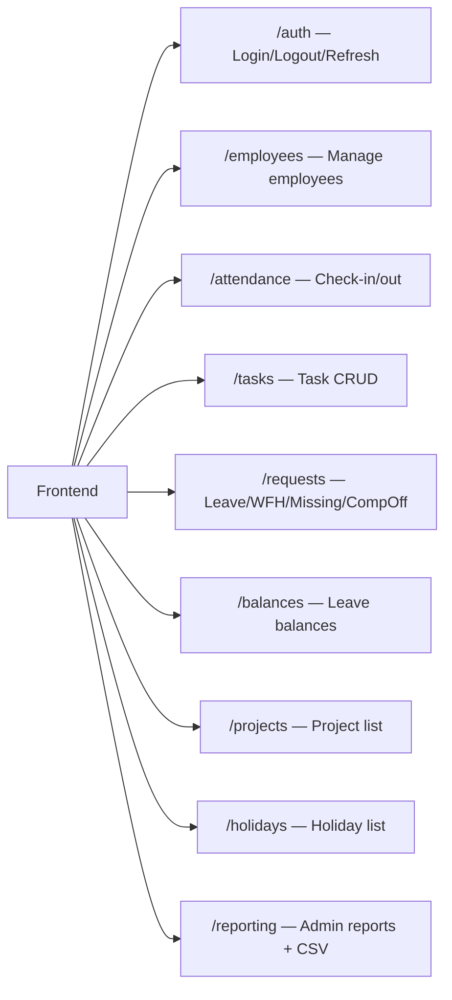

### Auth

| Method | Endpoint          | Who       | What                           |
| ------ | ----------------- | --------- | ------------------------------ |
| POST   | `/auth/login`   | Anyone    | Email + password → JWT tokens |
| POST   | `/auth/refresh` | Anyone    | Refresh token → new tokens    |
| POST   | `/auth/logout`  | Logged in | Revoke refresh token           |
| GET    | `/auth/me`      | Logged in | Current user profile           |

### Employees (Admin-only except `/me`)

| Method | Endpoint            | Who                 |
| ------ | ------------------- | ------------------- |
| GET    | `/employees`      | Admin               |
| POST   | `/employees`      | Admin               |
| GET    | `/employees/{id}` | Admin / Self        |
| PATCH  | `/employees/{id}` | Admin               |
| DELETE | `/employees/{id}` | Admin (soft-delete) |

### Attendance

| Method | Endpoint                                    | Who            | What                       |
| ------ | ------------------------------------------- | -------------- | -------------------------- |
| POST   | `/attendance/check-in`                    | Employee       | Start session + save tasks |
| PATCH  | `/attendance/check-out`                   | Employee       | End today's session        |
| GET    | `/attendance/session/today`               | Employee       | Get today's open session   |
| GET    | `/attendance/sessions`                    | Employee/Admin | Paginated list             |
| GET    | `/attendance/sessions/{emp_id}/monthly`   | Admin          | Full month for an employee |
| GET    | `/attendance/sessions/{emp_id}/avg-hours` | Admin/Self     | Average hours this month   |

### Tasks

| Method | Endpoint                                  | Who                      |
| ------ | ----------------------------------------- | ------------------------ |
| GET    | `/tasks/session/{session_id}`           | Owner/Admin              |
| POST   | `/tasks/session/{session_id}`           | Owner (while checked in) |
| PUT    | `/tasks/session/{session_id}/{task_id}` | Owner (while checked in) |
| DELETE | `/tasks/session/{session_id}/{task_id}` | Owner (while checked in) |

### Requests

| Method | Endpoint                   | Who      | What                           |
| ------ | -------------------------- | -------- | ------------------------------ |
| POST   | `/requests`              | Employee | Submit any request type        |
| GET    | `/requests`              | Employee | Own requests                   |
| GET    | `/requests/all`          | Admin    | ALL employees' requests        |
| PATCH  | `/requests/{id}/approve` | Admin    | Approve + trigger side-effects |
| PATCH  | `/requests/{id}/reject`  | Admin    | Reject + optional note         |
| DELETE | `/requests/{id}`         | Employee | Cancel own pending request     |

### Leave Balances

| Method | Endpoint               | Who                     |
| ------ | ---------------------- | ----------------------- |
| GET    | `/balances/me`       | Employee (own balances) |
| GET    | `/balances/{emp_id}` | Admin                   |
| GET    | `/balances/summary`  | Admin (all employees)   |

### Projects, Holidays, Reporting

| Method | Endpoint                                        | Who                          |
| ------ | ----------------------------------------------- | ---------------------------- |
| GET    | `/projects`                                   | Any (for task dropdown)      |
| POST   | `/projects`                                   | Admin                        |
| GET    | `/holidays`                                   | Any (for holiday list modal) |
| POST   | `/holidays`                                   | Admin                        |
| GET    | `/reporting/employee/{id}/monthly?format=csv` | Admin                        |
| GET    | `/reporting/leaves/summary`                   | Admin                        |

---

## Part 7 — Background Jobs

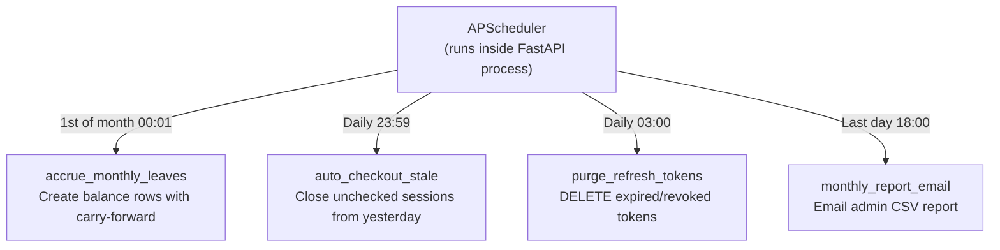

---

## Part 8 — Security Design

### JWT Token Flow

```
[Login]
  ↓
Access Token  (JWT, RS256, 15 min)  ← sent in every API request header
Refresh Token (opaque, 7 days)      ← used only to get new access token

Private Key: signs tokens    (kept secret on server)
Public Key:  verifies tokens (can be shared)
```

### Password Security

```
User sets password → Argon2id(password + salt) → store hash in DB
User logs in → Argon2id(input) → compare with stored hash
Plain password is NEVER stored or logged anywhere
```

### Role-Based Access Control (RBAC)

```python
# Every protected route checks this:
def require_admin(user = Depends(get_current_user)):
    if user.role not in ("admin", "super_admin"):
        raise HTTPException(403, "Admin access required")
    return user

# Employee can only access own data:
def require_self_or_admin(emp_id, user = Depends(get_current_user)):
    if user.id != emp_id and user.role != "admin":
        raise HTTPException(403, "Access denied")
```

---

## Part 9 — Project File Structure

```
HRMS-CheckIn-Out/
├── frontend/          ← existing React app (do not modify)
│   └── src/...
│
└── backend/           ← NEW — Python FastAPI
    ├── app/
    │   ├── main.py                 # App factory, CORS, routers
    │   ├── config.py               # .env settings via pydantic-settings
    │   ├── database.py             # Async SQLAlchemy engine + session
    │   │
    │   ├── models/                 # SQLAlchemy ORM models (1 file per table)
    │   │   ├── organization.py
    │   │   ├── employee.py
    │   │   ├── attendance_session.py
    │   │   ├── task_entry.py
    │   │   ├── leave_wfh_request.py
    │   │   ├── employee_leave_balance.py
    │   │   ├── project.py
    │   │   ├── holiday.py
    │   │   ├── refresh_token.py
    │   │   └── audit_log.py
    │   │
    │   ├── schemas/                # Pydantic v2 request/response models
    │   │   ├── auth.py
    │   │   ├── employee.py
    │   │   ├── attendance.py
    │   │   ├── task.py
    │   │   ├── request.py
    │   │   └── balance.py
    │   │
    │   ├── routers/                # FastAPI route handlers
    │   │   ├── auth.py
    │   │   ├── employees.py
    │   │   ├── attendance.py
    │   │   ├── tasks.py
    │   │   ├── requests.py
    │   │   ├── balances.py
    │   │   ├── projects.py
    │   │   ├── holidays.py
    │   │   └── reporting.py
    │   │
    │   ├── services/               # Business logic (no DB calls directly)
    │   │   ├── auth_service.py     # JWT creation, password verify
    │   │   ├── attendance_service.py
    │   │   ├── leave_service.py    # Approval side-effects
    │   │   ├── balance_service.py  # Carry-forward formula
    │   │   └── reporting_service.py # CSV builder
    │   │
    │   └── jobs/                   # Background cron tasks
    │       ├── accrue_leaves.py
    │       ├── auto_checkout.py
    │       └── purge_tokens.py
    │
    ├── alembic/
    │   ├── env.py
    │   └── versions/
    │       ├── 001_create_organizations.py
    │       ├── 002_create_departments.py
    │       ├── 003_create_employees.py
    │       ├── 004_create_refresh_tokens.py
    │       ├── 005_create_projects.py
    │       ├── 006_create_attendance_sessions.py
    │       ├── 007_create_task_entries.py
    │       ├── 008_create_leave_policies.py
    │       ├── 009_create_leave_balances.py
    │       ├── 010_create_leave_requests.py
    │       ├── 011_create_holidays.py
    │       ├── 012_create_audit_logs.py
    │       ├── 013_seed_org_and_projects.py
    │       ├── 014_seed_holidays.py
    │       └── 015_seed_demo_employees.py
    │
    ├── tests/
    │   ├── test_auth.py
    │   ├── test_attendance.py
    │   ├── test_leave.py
    │   └── test_reporting.py
    │
    ├── .env.example
    ├── requirements.txt
    ├── Dockerfile
    └── docker-compose.yml
```

---

## Part 10 — Docker Dev Environment

```yaml
# docker-compose.yml
version: "3.9"
services:
  db:
    image: postgres:16-alpine
    environment:
      POSTGRES_DB: hrms_db
      POSTGRES_USER: hrms_user
      POSTGRES_PASSWORD: hrms_secret
    ports: ["5432:5432"]
    volumes: [pg_data:/var/lib/postgresql/data]

  redis:
    image: redis:7-alpine
    ports: ["6379:6379"]

  backend:
    build: ./backend
    env_file: backend/.env
    ports: ["8000:8000"]
    depends_on: [db, redis]
    volumes: [./backend:/app]
    command: uvicorn app.main:app --host 0.0.0.0 --port 8000 --reload

volumes:
  pg_data:
```

**To start everything:**

```bash
docker compose up -d db redis   # start DB + cache
cd backend
alembic upgrade head             # run all migrations
uvicorn app.main:app --reload    # start API
```

---

## Part 11 — What Feeds What (Frontend ↔ Backend Mapping)

| Frontend Element         | API Call                                            | DB Query                              |
| ------------------------ | --------------------------------------------------- | ------------------------------------- |
| Header "Avg. time 9.3h"  | GET `/attendance/avg-hours`                       | `AVG(total_hours)` WHERE this month |
| Header "Leaves left: 1"  | GET `/balances/me`                                | `closing_balance` casual            |
| Header "Comp off: 2"     | GET `/balances/me`                                | `closing_balance` comp_off          |
| Project dropdown in form | GET `/projects`                                   | SELECT active projects                |
| Holiday list modal       | GET `/holidays`                                   | SELECT holidays for year              |
| Daily Tasks table        | GET `/attendance/sessions` monthly                | JOIN sessions + tasks                 |
| Download CSV button      | GET `/reporting/employee/{id}/monthly?format=csv` | Same + CSV format                     |
| Admin employee dropdown  | GET `/employees`                                  | SELECT all active employees           |
| Admin "Avg. time 9.3h"   | GET `/attendance/{emp_id}/avg-hours`              | Same avg query                        |
| Admin Leave Summary      | GET `/balances/summary`                           | JOIN balances + employees             |
| Admin Requests table     | GET `/requests/all`                               | SELECT all requests                   |
| Approve button           | PATCH `/requests/{id}/approve`                    | UPDATE status + side-effects          |
| Reject button            | PATCH `/requests/{id}/reject`                     | UPDATE status                         |

---

## Part 12 — Summary for Team Presentation

```
┌─────────────────────────────────────────────────────┐
│                  HRMS System Summary                │
├─────────────────────────────────────────────────────┤
│ Users:    1 table (employees), role column controls  │
│           who sees what                             │
│ Sessions: 1 per employee per day, UNIQUE enforced   │
│ Tasks:    Many per session, tied to projects        │
│ Leaves:   Ledger table, computed monthly, carried   │
│ Requests: 4 types (leave/wfh/missing/compoff)       │
│           Each approval triggers DB side-effects    │
│ API:      35+ endpoints, JWT protected, role-gated  │
│ Jobs:     4 cron jobs (accrue, checkout, purge,     │
│           report)                                   │
│ Export:   CSV from backend streaming response       │
│ Audit:    Every admin action logged permanently     │
└─────────────────────────────────────────────────────┘
```

> [!IMPORTANT]
> **One decision still needed from the team:** Is the Admin a dedicated HR-only account (no attendance tracking) — OR — is the Admin also a working employee who checks in/out? This determines whether we create attendance sessions for admin accounts. Everything else in the plan is final and ready to implement.
